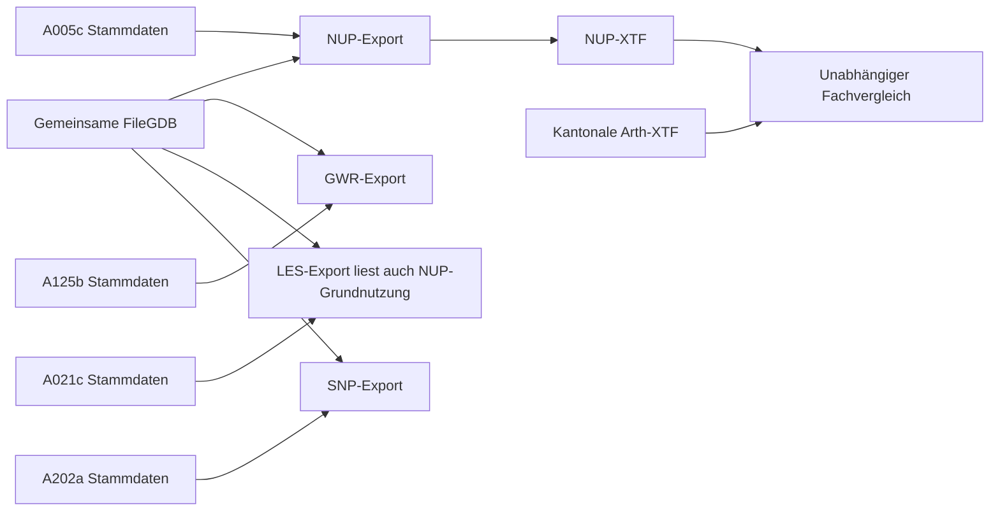

# Referenzanalyse: tatsächliche Eingänge und GDB → INTERLIS-Mapping

Stand: 9. Oktober 2026. Ausschließlich statische Analyse, keine Umsetzung.
Dieser Bericht aktualisiert die anfängliche Bestandsaufnahme anhand des
nachgereichten Referenzpakets. Die bisherigen Architekturprinzipien bleiben
bestehen; konkrete neue Befunde und notwendige Anpassungen stehen hier.

## 1. Ergebnis zur zentralen Abhängigkeitsfrage

**Stammdaten-XTFs sind in allen vier FME-Workbenches echte Exporteingänge.**
Sie liefern Katalogobjekte, die in die Ausgabe geschrieben werden, und deren
Objektkennungen zur Bildung von Referenzen. Sie dienen damit nicht ausschließlich
dem Vergleich oder der Validierung. Der Eingangsreader ist jeweils aktiviert
und hat angeschlossene Datenwege zu Writer und FeatureMergern.

**Gemeinde-XTFs sind in den vier untersuchten Workbenches keine Exporteingänge.**
Es gibt jeweils genau einen INTERLIS-Stammdatenreader und einen FileGDB-Reader,
aber keinen Gemeinde-XTF-Reader, FeatureReader oder entsprechenden Download-
Transformer. Die Exportgeometrien und gemeindespezifischen Typen/Metadaten
kommen aus der GDB. Die angebotene kantonale `Arth.xtf` kann deshalb als
unabhängige Vergleichs- und Prüfquelle untersucht werden; ihre fachliche
Gleichwertigkeit zum Büro-Datenstand ist noch nicht nachgewiesen.

Auch eine Vergleichs-XTF ersetzt keine ILI-Modelle. Für die Modellvalidierung
werden die ILI-Dateien mit Importkette und gegebenenfalls Referenzkataloge
benötigt. Ob der spätere Validator zusätzliche externe Objekte aus einer
Gemeinde-XTF braucht, ist ohne ILI/Kataloge nicht entschieden; im FME-Exportgraph
ist diese zusätzliche Eingangsabhängigkeit nicht vorhanden.

| Modul | Aktiver Stammdateneingang laut FME | Aktive GDB-Eingänge laut FME |
|---|---|---|
| NUP | `http://data.geo.sz.ch/public/Themen/A005c/Stammdaten.xtf` | Sechs Feature Classes unter `NUP/`, `NUP_Typ`, `NUP_TM_Datenbestand` |
| GWR | `https://data.geo.sz.ch/public/Themen/A125b/Stammdaten.xtf` | `GWR_Flächen`, `GWR_TM_Datenbestand` |
| LES | `http://data.geo.sz.ch/public/Themen/A021c/Stammdaten.xtf` | `NUP/Grundnutzung_Zonenflaeche`, `LES_Typ`, `LES_TM_Datenbestand` |
| SNP | `http://data.geo.sz.ch/public/Themen/A202a/Stammdaten.xtf` | `SNP_Flächen`, `SNP_Typ`, `SNP_TM_Datenbestand` |

Die zusätzlich genannte A005c-Datei deckt laut Workbench-Konfiguration **NUP**
ab. Sie ist nicht ohne Prüfung der Inhalte als gemeinsamer Katalog für alle
vier Module verwendbar. Die anderen drei Themenpfade sind aus FME nachgewiesen,
ihre aktuellen Inhalte und Erreichbarkeit wurden noch nicht bestätigt.

SNP besitzt eine besonders irreführende Parameterbenennung: `ImportStammdaten`
ist der XTF-Eingang. Der Parameter `Stammdaten` bezeichnet dort dagegen den
**Writer-Ausgabepfad**. Der Name eines Parameters allein bestimmt seine Funktion
nicht. Die Reader-/Writer-Dataset-Verknüpfung klärt diese Rollen eindeutig.

Die LES-Quellabhängigkeit von einer NUP-Tabelle erfordert **keinen NUP-Export**.
Ein allein ausgewähltes LES-Modul muss diese Tabelle lesen dürfen, ohne eine
NUP-XTF zu erzeugen oder sämtliche NUP-Eingänge zu prüfen.

## 2. Belege und Grenzen der Untersuchung

Paket: `SZ_INTERLIS_Codex_Referenzen_VORPRUEFUNG.zip`, SHA-256
`e34db2002998b04addd07fb1f6ecc9a5c635f08f150beb5892d8accd414e4877`.
Es enthält vier FMW-Dateien, zwei Strukturinventare, Vorprüfbericht und Hinweise.
Die XML-Workbenchbeschreibung wurde als Daten gelesen, aktive Links einschließlich
Ports untersucht und relevante generierte FME-Direktiven statisch gegengeprüft.
Kein Tcl, Python, FME-Ausdruck oder Workbench wurde ausgeführt.

| Profil | Datei | Top-Level-Transformer | Top-Level-Links |
|---|---|---:|---:|
| NUP | `filegdbV2_2_xtf_final.fmw` | 106 | 135 |
| GWR | `filegdbV2_to_xtf_GWR.fmw` | 30 | 40 |
| LES | `filegdbLESV2_2_xtf.fmw` | 43 | 57 |
| SNP | `filegdbV1_to_xtf_SNP_V1.fmw` | 40 | 52 |

NUP besitzt zusätzlich einen eingebetteten Custom-Transformer
`Basket_Geobasisdaten`, der auf sieben Hauptpfaden verwendet wird. Er erzeugt
die Geobasisdaten-Basketkennung und enthält keinen eigenen Datei-Reader.

Die [strukturellen Nachweise](FME_Strukturnachweise.json) dokumentieren Hashes
der tatsächlich gelieferten bereinigten FMW-Dateien, Nodes mit Zeilennummern,
FME-Schemadeklarationen, Ports, Linkaktivierung und ausgewählte Transformations-
parameter. Die im Paket genannten Originalhashes sind davon zu unterscheiden;
die Originaldateien wurden nicht zur Hashprüfung geliefert.

Die [Mapping-Matrix](Mapping_GDB_INTERLIS.csv) ersetzt das frühere offene
Arbeitsgerüst: 122 Regeln zu Klassenrouting, gleichnamigen Attributen, IDs,
Geometrien, Beziehungen, Filtern und Katalogexport. Sie ist eine statisch
belegte Beschreibung des FME-Verhaltens, noch keine fachlich freigegebene
Exportspezifikation. Nodefolgen in Belegen können bei Join-Regeln sowohl den
Requestorpfad als auch Zuliefer-Nodes nennen; Ports stehen im JSON-Nachweis.

Wichtig: Graph-Erreichbarkeit über einen Supplier-Port macht ein Katalogobjekt
nicht zur Quelle einer Zonenfläche. FeatureMerger erzeugen auf ihrem `MERGED`-
Ausgang angereicherte Requestorobjekte; die Supplier liefern Attribute und IDs.
Ein reiner Pfadvergleich ohne Portauswertung würde hier falsche Mappings ergeben.

### Was die gelieferten Inventare tatsächlich belegen

- Das GDB-Inventar zählt 139 Containerdateien und deren Endungen. Es enthält
  **keine Tabellen-/Feldübersicht**. Die unten genannten GDB-Namen stammen aus
  den FME-Readerdeklarationen und müssen gegen eine Schema-Only-Ausgabe oder
  die echte GDB geprüft werden.
- Das XTF-Inventar zählt XML-Tagnamen und direkte Attribute. Topic-/Basket-Tags
  werden unter „Objekttypen“ mitgezählt. Ein Topic mit Anzahl 1 ist kein
  zusätzliches fachliches Objekt und belegt weder TIDs noch Referenzauflösung.
- Original-XTF, TIDs/BIDs, Werte, Geometrien, Transferheader und ILI-Dateien
  fehlen im Paket. Es wurde keine INTERLIS-Validierung durchgeführt.
- Die vom Nutzer genannten kantonalen NUP-Dateien konnten weder über HTTPS
  noch über die angegebenen HTTP-Adressen geladen werden: Netzwerkproxy HTTP
  403, keine XML-Inhalte erhalten. TLS-Verifikation wurde nicht abgeschaltet.
  Dieser Befund ist kein Nachweis, dass die Dateien beim Kanton fehlen.

## 3. Konkretes Klassenmapping

Alle Zielnamen in der Tabelle sind hinter dem jeweiligen Modellpräfix angegeben.

| Profil | GDB-Readerklasse | INTERLIS-Ziel | Hauptpfad: Source → Transformer → Writer |
|---|---|---|---|
| NUP | `NUP/Grundnutzung_Zonenflaeche` | `Geobasisdaten.Grundnutzung_Zonenflaeche` | 303 → 119 → 97 → 47 → 103 → 49 → 83 → 108 → 109 → 84 → 106 → 116 → 13 |
| NUP | `NUP/Ueberlagernde_Festlegung` | `Geobasisdaten.Ueberlagernde_Festlegung` | 306 → 122 → 98 → 58 → 59 → 90 → 85 → 114 → 10 |
| NUP | `NUP/Linienbezogene_Festlegung` | `Geobasisdaten.Linienbezogene_Festlegung` | 304 → 124 → 99 → 63 → 64 → 91 → 86 → 112 → 12 |
| NUP | `NUP/Objektbezogene_Festlegung` | `Geobasisdaten.Objektbezogene_Festlegung` | 305 → 126 → 100 → 68 → 74 → 87 → 7 |
| NUP | `NUP/Wirkbereich_Linie` | `Geobasisdaten.Wirkbereich_Linie` | 307 → 128 → 101 → 69 → 70 → 92 → 88 → 8 |
| NUP | `NUP/Wirkbereich_Punkt` | `Geobasisdaten.Wirkbereich_Punkt` | 308 → 129 → 102 → 78 → 79 → 93 → 89 → 9 |
| NUP | `NUP_Typ` | `Geobasisdaten.Typ` | 310 → 96 → 36 → 40 → 56 → 14 |
| NUP | `NUP_TM_Datenbestand` | `TransferMetadaten.Datenbestand` | 309 → 30 → 32 → 31 → 35 → 55 → 6 |
| GWR | `GWR_Flächen` | `Geobasisdaten.Gewaesserraum` | 120 → 35 → 41 → 86 → 101 → 103 → 112 |
| GWR | `GWR_TM_Datenbestand` | `TransferMetadaten.Datenbestand` | 123 → 44 → 46 → 55 → 60 → 64 → 115 |
| LES | `NUP/Grundnutzung_Zonenflaeche` | `Geobasisdaten.Laermempfindlichkeitszone` | 152 → 138:FAILED → 137 → 139 → 32 → 78 → 81 → 106 → 107 → 121 → 12 |
| LES | `LES_Typ` | `Geobasisdaten.Typ` | 147 → 43 → 52 → 58 → 62 → 117 → 10 |
| LES | `LES_TM_Datenbestand` | `TransferMetadaten.Datenbestand` | 142 → 37 → 39 → 41 → 111 → 15 |
| SNP | `SNP_Flächen` | `Geobasisdaten.Geometrie` | 162 → 157 → 161 → 133 → 180 → 269 → 273 → 143 |
| SNP | `SNP_Typ` | `Geobasisdaten.Typ` | 178 → 102 → 150 → 100 → 159 → 135 |
| SNP | `SNP_TM_Datenbestand` | `TransferMetadaten.Datenbestand` | 177 → 61 → 80 → 140 → 74 → 163 → 142 |

Die Hauptpfade lassen einige reine Renamer/Remover/Junctions aus; vollständige
Klassenpfade stehen in der CSV. Die Reader-Geometrie ist FME-Metadatum, kein
neuer Befund zum realen FileGDB-Inhalt. Insbesondere sind Wirkbereiche nicht
allein wegen „Linie/Punkt“ im Namen als Linien-/Punktgeometrie zu interpretieren.

## 4. Attribute, IDs und Beziehungen

### NUP

- Die sechs Geometrieklassen lesen `xtf_id`, `Code`, `Rechtsstatus` und
  grundsätzlich `Bemerkung`. Wirkbereiche lesen zusätzlich bereits vorhandene
  `rLinienbezogene_Festlegung` bzw. `rObjektbezogene_Festlegung`.
- `Code = NUP_Typ.Code` liefert die **Typ-ID** als `rTyp` (Zulieferaufbereitung
  Node 48). Die geometrischen Features behalten ihre eigene `xtf_id`.
- `Rechtsstatus = Katalogeintrag.Code` liefert `rRechtsstatus` (Renamer 50,
  sechs nachgelagerte Merger). Nur im Grundnutzungspfad wird der Status zuerst
  normalisiert: `in Kraft → inKraft`, `Änderung/Aenderung → AenderungOhneVorwirkung`
  (Node 103). Andere Statuswerte bleiben dort unverändert.
- `NUP_Typ.Code_Kanton = Stammdaten.Typ_Kanton.Code` liefert `rTyp_Kanton`
  (Nodes 37/36). `NUP_Typ.Verbindlichkeit = Katalogeintrag.Code`, umbenannt
  in `Code_Verbindlichkeit`, liefert `rVerbindlichkeit` (Nodes 41/40).
- `Code`, `Bezeichnung`, `Abkuerzung`, `Nutzungsziffer`, `Nutzungsziffer_Art`,
  `Doklink`, `Symbol` sind namensgleich im Quell-/Writer-Schema deklariert.
  `GemeindeNr` ist im Reader vorhanden, aber kein gleichnamiges Writerfeld.
  Ein GemeindeNr-Filter ist in den untersuchten aktiven Transformern nicht belegt.
- Die Wirkbereich-Rollen werden als vorhandene Quellfelder weitergereicht;
  ein eigener Join zur Überprüfung ihres Zielobjekts ist im Pfad nicht erkennbar.
  Ihre Auflösbarkeit muss der neue Exporter ausdrücklich prüfen.

### GWR

- `GWR_Flächen.Typ = Stammdaten.Typ.Code` liefert `rTyp` (Nodes 83/41).
  GWR benötigt nach diesem Graph **keine GWR_Typ-Bürotabelle**.
- `Rechtsstatus = Katalogeintrag.Code` liefert `rRechtsstatus` (Nodes 89/86).
- `xtf_id`, `Gewaessername`, `Doklink`, `Bemerkung` bleiben im deklarierten
  Quell-/Writer-Schema namensgleich; Typ/Rechtsstatus werden zu Referenzen.

### LES

- Exportquelle ist die NUP-Grundnutzung. `LES_Typ = LES_Typ.Abkuerzung`
  liefert `rTyp` (Nodes 80/81); Rechtsstatus wird über dessen Katalog-Code aufgelöst.
- Für `rTyp_Kanton` wird **`LES_Typ.Bezeichnung = Stammdaten.Typ_Kanton.Name`**
  verwendet (Nodes 53/52), nicht das ebenfalls deklarierte Quellfeld `Typ_Kanton`.
  Das Quellfeld wird später entfernt. Dieser Namensjoin ist sprach-/schreibweisen-
  abhängig und vor fachlicher Übernahme zu prüfen.
- `Verbindlichkeit = Stammdaten.Verbindlichkeit.Name` liefert `rVerbindlichkeit`
  (Nodes 57/58), ebenfalls kein Code-Join.
- Die Quell-`xtf_id` der Grundnutzung wird entfernt und eine neue UUID (`UUID_ONLY`)
  erzeugt (Nodes 137/139). Gleiche Quelle kann so bei jedem Lauf neue LES-TIDs
  erhalten. Es darf kein bytegleicher Referenzvergleich erwartet werden.
- `LES_Typ` gleich `keineES` oder `keine_ES` verlässt den Tester am unverbundenen
  `PASSED`-Port. Nur `FAILED` wird exportiert. Ein paralleler TestFilter prüft
  Codepräfixe 44, 32 oder 18 und führt zum Terminator (Nodes 166/164).
- `Bemerkung` wird im Geometriepfad ausdrücklich auf NULL gesetzt. Das
  Strukturinventar führt dieses Feld in den LES-Geometrieobjekten nicht auf;
  ohne ILI ist noch nicht entschieden, ob dies korrekt ausgelassen wird.

### SNP

- `SNP_Flächen.Typ = SNP_Typ.Code` liefert `rTyp` (Nodes 129/133).
- `Code_Kanton` wird aus den ersten vier Zeichen von `SNP_Typ.Code` gebildet
  (`@Substring(Code,0,4)`, Node 150) und gegen `Typ_Kanton.Code` gejoint.
  Die Zielrolle heißt im vorhandenen Writer und XTF-Inventar **`rTyp_Kt`**,
  nicht `rTyp_Kanton`.
- Rechtsstatus wird wie bei NUP/GWR über Katalog-Code und Katalog-ID aufgelöst.
  `xtf_id`, `Code`, `Bezeichnung`, `Abkuerzung`, `Doklink` sind für Typobjekte
  namensgleich deklariert; Geometrieobjekte behalten `xtf_id` und `Bemerkung`.

### Transfermetadaten und Join-Verhalten aller Profile

`*_TM_Datenbestand` liefert `xtf_id`, `Stand`, `Bemerkung`, `Lieferinhalt`.
Aus der Katalog-ID wird `rLieferinhalt`. In NUP, GWR und SNP wird Lieferinhalt
vorher mit `@GetWord(Lieferinhalt,1)` normalisiert; LES joint direkt gegen
`Lieferinhalt = Stammdaten.Lieferinhalt.Name`. Es darf nicht ungeprüft angenommen
werden, dass ein identischer Normalisierer für alle vier Profile passt.

Alle vier verwenden `DateTimeConverter` mit Ausgabe `%Y-%m-%d` und
`REPAIR_INPUT=YES`. NUP enthält zusätzlich das deklarierte Eingabeformat
`%Y%m%d$`. Dieses FME-spezifische Eingabe-/Reparaturverhalten muss anhand echter
Date-Werte überprüft werden; der neue Exporter darf ungültige Datumswerte nicht
unbemerkt korrigieren.

Die untersuchten FeatureMerger übernehmen nur Attribute und bevorzugen bei
Attributkonflikten den Requestor (`Use Requestor`), mit `PROCESS_DUPS=NO`.
Sie sind kein Nachweis eindeutiger Lookup-Schlüssel. Besonders Name-Joins,
NULL-Schlüssel und nicht verbundene `UNMERGED_REQUESTOR`-Ports brauchen neue
Pflichtprüfungen. LES hat angeschlossene Abbruchpfade für nicht aufgelöste
Typ-/Rechtsstatus-/Verbindlichkeits-Joins; GWR und SNP besitzen an den untersuchten
entsprechenden Merkern keine vergleichbare vollständige Abbruchverkabelung.

In NUP/GWR/SNP wird im aktiven Hauptpfad die bereits vorhandene `xtf_id` genutzt.
Eine Neuerzeugung aus `OBJECTID` oder GlobalID ist nicht belegt. `OBJECTID` wird
im Verlauf entfernt. Die endgültige OID-Zulässigkeit und globale Eindeutigkeit
können erst mit ILI und echten IDs geprüft werden.

## 5. Stammdatenexport, Basketkennungen und Writerprüfung

NUP/GWR/SNP lesen eine generische `Stammdaten.Katalogeintrag`-Klasse sowie
`Typ_Kanton` beziehungsweise GWR-`Typ`. Tester teilen Katalogeinträge in
Lieferinhalt und Rechtsstatus auf; NUP verwendet den restlichen Zweig für
Verbindlichkeit. Das ist **kein modellunabhängiger Katalogparser**:

- NUP: Code beginnt mit `13` → Lieferinhalt; verbleibende Codes
  `AenderungMitVorwirkung`, `AenderungOhneVorwirkung`, `inKraft` → Rechtsstatus;
  anderer Rest → Verbindlichkeit (Nodes 45/46).
- SNP: Lieferinhalt ebenfalls Codepräfix `13`; Rechtsstatus anhand derselben
  drei Statuscodes (Nodes 125/131).
- GWR: Lieferinhalt umfasst Codepräfix `13` und zwei zusätzlich namentlich
  konfigurierte Gebietseinträge (Node 27); Rechtsstatus anhand der drei Codes
  (Node 74). Diese Sonderfälle sind nicht pauschal auf Arth zu übertragen.
- LES liest bereits die vier konkreten Klassen `Lieferinhalt`, `Rechtsstatus`,
  `Verbindlichkeit`, `Typ_Kanton`, ohne diesen generischen Split.

Katalogkennungen `xtf_id` werden als Objekt- und Referenzkennungen erhalten.
Stammdatenobjekte werden aktiv in die Ausgabe geschrieben, nicht nur temporär
für einen Join gelesen. Bestehende unbekannte Katalog-IDs dürfen nicht durch
eigene laufende Nummern ersetzt werden.

| Profil | Geobasisdaten-BID | TransferMetadaten-BID | Stammdaten-BID laut FME |
|---|---|---|---|
| NUP | `ch.sz.a005c.geobasisdaten.$(Bfs_Nr)` | `ch.sz.a005c.transfermetadaten.$(Bfs_Nr)` | `ch.sz.a005.stammdaten.2000-01-01` |
| GWR | `ch.sz.a125b.geobasisdaten.$(Bfs_Nr)` | `ch.sz.a125b.transfermetadaten.$(Bfs_Nr)` | `ch.sz.a125.stammdaten.2026-09-09` |
| LES | `ch.sz.a021c.geobasisdaten.$(Bfs_Nr)` | `ch.sz.a021c.transfermetadaten.$(Bfs_Nr)` | `ch.sz.a021.stammdaten.2026-09-09` |
| SNP | `ch.sz.a202a.geobasisdaten.$(Bfs_Nr)` | `ch.sz.a202a.transfermetadaten.$(Bfs_Nr)` | `ch.sz.a202.stammdaten.2000-01-01` |

Die konstanten Datumsteile sind historische Katalog-Basketkennungen,
keine nachgewiesenen fachlichen Datenstandwerte und kein Anlass, automatisch
das Tagesdatum einzusetzen. Bei allen Profilen werden drei `XTF_BASKETS`-
Features aus einem Creator erzeugt und Objekt-Basketattribute entsprechend
gesetzt. Tatsächliche Transferheader, vollständige Modellrevisionen und
Konsistenzattribute bleiben ohne vollständige XTF/ILI offen.

Die Workbench-Defaults sind **nicht Arth-gültig**: NUP hat BFS 1341, SNP 1301;
GWR und LES verwenden im Parameter `Bfs_Nr` einen nicht numerischen Teilgebiets-
namen. Der neue Arth-Lauf muss explizit **1362** verwenden. Ein numerischer
BFS-Kontext und allfällige Teilgebietskennungen dürfen künftig nicht in demselben
Parameter vermischt werden.

| Profil | Stammdatenreader: VALIDATE / MULTIPLICITY | Writer: VALIDATE / MULTIPLICITY |
|---|---|---|
| NUP | Yes / Yes | **No / No** |
| GWR | Yes / Yes | Yes / Yes |
| LES | Yes / Yes | Yes / Yes |
| SNP | Yes / Yes | Yes / Yes |

Beleg: generierte `DEFAULT_MACRO`-Direktiven; NUP Writer Zeilen 8672/8675.
Das sind gespeicherte Defaults, keine geprüften Laufprotokolle. Ein bisheriger
FME-Erfolg ist damit insbesondere für NUP kein Konformitätsnachweis.
Die Workbenches nutzen `%DATA` zur Modellwahl und Modellpfade mit Online-
Repository und lokaler FME-Ablage; ein konkreter vollständiger Modellpin ist
dadurch nicht belegt. Der neue Exporter benötigt vollständige lokale Pins und
eine verpflichtende separate Ausgangsvalidierung für alle Module.

## 6. Geometrie: bewusste Abweichung vom AV-Aufbereiter

Alle vier Workbenches enthalten im aktiven Geometrieexport einen `ArcStroker`
mit maximaler Abweichung **0.0005 in Koordinateneinheiten**, gefolgt von einem
`CoordinateRounder` mit **drei Dezimalstellen für X/Y/Z**. NUPs objektbezogene
Punktfestlegung hat nur den Rounder; die anderen fünf Geometriepfade haben
ArcStroker. FME-Reader von GWR und SNP deklarieren EPSG:2056; bei NUP und LES
ist die entsprechende Readerangabe leer. Die tatsächlichen CRS aller Klassen
bleiben über die GDB zu bestätigen. Erst bei Meterkoordinaten lässt sich 0.0005
als 0.5 mm interpretieren.

Der AV-Aufbereiter erhielt native Bögen. **Diese Politik darf nicht automatisch
übernommen werden:** Die hier vorliegenden Exportworkbenches linearisieren
Bögen ausdrücklich. Ob das amtliche Zielmodell Bögen erlaubt oder verbietet,
ist ohne ILI nicht geklärt. Zu entscheiden ist ein belegtes Profilverhalten,
das Kantonsmodell, Geometriequalität und gewünschten FME-Vergleich berücksichtigt.
Die Linearisierung muss sichtbar und getestet sein, niemals still erfolgen.

NUP-Grundnutzung verwendet zusätzlich `AreaOnAreaOverlayer` mit automatischer
Cleaning-Toleranz und Attributübernahme aus **einem** Feature, dann `Dissolver`
mit Gruppierung nach `xtf_id` und wiederum automatischer Cleaning-Toleranz
(Nodes 108/109; generierte Overlay-/Dissolve-Direktiven vorhanden). Das ist
keine reine Serialisierung: Objektzerlegung, Vereinigung und Attributwahl
können Ergebnisse beeinflussen. Ein GEOS-/GDAL-Ersatz ist nicht ohne echten
Geometrievergleich als FME-äquivalent anzusehen.

LES hat einen parallelen Overlay-Prüfzweig mit Cleaning-Toleranz 0 und einem
Tester `_overlaps > 1` (Nodes 155/150). Dieser Zweig speist nicht den Writer-
Geometriepfad; er ist daher **keine Reparatur oder Dissolve der LES-Ausgabe**.
Die Hauptgeometrie geht über die Referenz-Joins zum ArcStroker/Rounder.

NUP verwendet `DuplicateFilter` nach `xtf_id` vor allen sechs Quellpfaden sowie
zusätzlich nach Overlay/Dissolve. Der nachgelagerte Duplicate-Terminator 107
ist deaktiviert. Die vorangeschlossenen Duplicate-Abbruchpfade sind davon
zu unterscheiden. Der neue Exporter muss Dubletten und Geometrieänderungen
vollständig zählen und darf weggefallene Teilobjekte nicht still ignorieren.

## 7. Referenz-XTF-Inventar: neue Auffälligkeiten

| Profil | Im Strukturinventar beobachtet | Bedeutung für den nächsten Vergleich |
|---|---|---|
| NUP | 1'266 Grundnutzungen, 144 Überlagerungen, 33 Linienfestlegungen, 29 Objektfestlegungen, 24 Wirkbereiche Linie, 29 Wirkbereiche Punkt, 61 Typen | Vergleichszahlen für genau diese Lieferung, keine fest programmierten Sollzahlen |
| GWR | Nur Lieferinhalt (32), Rechtsstatus (2), Typ (2) sowie Topics; **keine Gewaesserraum- oder Datenbestandobjekte aufgelistet** | Die Inventardatei belegt keinen tatsächlich gefüllten GWR-Geometrieexport; vollständige Referenz oder bewusst leerer Umfang klären |
| LES | 809 Laermempfindlichkeitszonen, sechs Typen | Bekannte Fehler bleiben bestehen; Anzahl ist kein Gültigkeitsnachweis |
| SNP | 22 Typen und 22 Geometrien | Referenzen und Geometrien mit vollständiger XTF prüfen; Zielrolle rTyp_Kt bestätigt |

Die Dateinamenpräfixe 1341 liefern keinen BFS-Nachweis für Arth. Relevant ist
der Projektauftrag **1362**, künftig gegen die Daten und Metadaten geprüft.
Auch öffentliche Kantonsdaten können einen anderen Stand als die Büro-GDB
haben. Ein Unterschied ist zunächst zu klassifizieren, bevor ein Mapping
oder eine Ausgabe zur Anpassung an die Referenz geändert wird.

## 8. Architektur- und Testanpassungen nach diesen Befunden

Die im AV-Projekt bewährten GUI-/Worker-, Manifest-, Diagnose-, Windows-Runtime-
und Relokationsprinzipien bleiben geeignet. Ergänzungen zum bisherigen Vorschlag:

1. **Versionierter Katalogadapter je Profil:** Einmal gesichert bezogene
   Stammdaten mit Herkunft, Hash, Modellrevision und Katalog-IDs lokal paketieren
   beziehungsweise in einer freigegebenen Profilressource ablegen. Der Mitarbeiter
   soll keine Netzdatei suchen müssen. Zulässige Weitergabe und Aktualisierung
   werden vor Auslieferung geprüft; keine ungeprüften laufenden Downloads.
2. **Getrennte Export- und Vergleichseingänge:** Die Gemeinde-XTF ist optionaler
   Eingang des Vergleichswerkzeugs, nicht Voraussetzung für einen regulären
   Export. Kataloge und ILI-Modelle sind tatsächliche Profilabhängigkeiten.
3. **Tabellenabhängigkeiten explizit:** LES darf auf NUP-Grundnutzung zugreifen,
   ohne NUP auszuführen. GWR benötigt keine erfundene Typ-Tabelle. Die Prüfung
   richtet sich nach dem ausgewählten Profil und seinen belegten Eingängen.
4. **Keine allgemeine Namens-/Code-Join-Regel:** Profilregeln unterscheiden
   Code-, Name-, Abkürzungs- und Substring-Joins. Eindeutigkeit, NULL-Werte,
   fehlende Treffer und Rolle/TID-Auflösung werden vor dem Writer geprüft.
5. **Explizite Geometriepolitik:** AVs Kurvenerhalt und FME-Linearisierung sind
   verschiedene fachliche Verträge. Rundung und Overlay benötigen eigene
   Tests, Toleranzen und freigegebene Regeln je Klasse.
6. **Pflichtvalidator nach Ausgabe:** NUPs abgeschaltete Validierung wird
   nicht übernommen. Der bisher empfohlene paketierte ilivalidator mit lokaler
   Java-Laufzeit bleibt eine geeignete Wahl, die an den exakten Modellen zu
   verifizieren ist. Kandidaten werden erst nach allen Pflichtprüfungen freigegeben.

Zusätzliche gezielte Tests: fehlender/falscher Katalog; duplicate Code/Name-
Schlüssel; LES-Bezeichnung versus Typ_Kanton; keineES/keine_ES; LES mit NUP
nicht ausgewählt; SNP-Code kürzer als vier Zeichen; NUP-Statusnormalisierung
nur im belegten Pfad; Wirkbereich-Rollen auf fehlende Objekte; in jedem Lauf
geänderte LES-UUIDs; bewusst leerer GWR-Export; FME-Overlay-Attributwahl und
Rundung von sehr kleinen Flächen. Ein Warn-/Fehlervergleich mit LES darf bekannte
Fehler nicht durch deaktivierte Regeln unsichtbar machen.

Ein frühes natives Windows-Paket bleibt erforderlich: keine Mitarbeiter-
Installation von Python, FME, ArcGIS oder Java; vollständige GDAL/PROJ/Tk-/JRE-
Abhängigkeiten, Unicode-/Leerzeichenpfade, Relokation und Betrieb ohne Adminrechte
werden real geprüft. Die AV-Testnachweise bestätigen diese neue Anwendung nicht.

## 9. Sicherheitsprüfung des nachgereichten Pakets

Archivpfade, Gesamtgröße und Symlinkmarkierungen wurden vor der Extraktion
geprüft. Die Analyse erfolgte außerhalb des Git-Repositorys. Die vier FMW-
Originale aus dem Paket, Vorschaubilder und Rohinventare wurden nicht übernommen.
Die beigefügten Textdokumente wurden als Aussagen über das Paket ausgewertet;
sie erteilen keine neue Ausführungs- oder Implementierungsfreigabe.

Keine privaten Schlüssel, Zugangsdaten in URLs oder nichtleeren Workbench-
`PASSWORD`-Werte wurden durch die untersuchten Muster gefunden. Die Start-/End-
Python-/Tcl-Felder sind leer; Transformer vom Typ Python/Tcl/SQL/HTTP/FeatureReader
sind nicht vorhanden. Generierte FME-/Tcl-Direktiven bleiben ausführbarer Code
und wurden ausschließlich statisch gelesen, nicht ausgeführt.

**Bereinigung ist unvollständig:** Nach ersetzten Pfadpräfixen bleiben
Pfadsuffixe mit Projekt-/Ablagestruktur, historischen Arbeitsdateinamen und
Kontextbezeichnungen stehen. Betroffen sind alle vier Workbenches. Die
Analyse fand 20/15/12/16 solche Vorkommen in NUP/GWR/LES/SNP; das sind
heuristische Vorkommen, keine Zahl unabhängiger Geheimnisse. Inhalte werden
hier nicht reproduziert. Einige Speicherverzeichnisangaben existieren mehrfach
in XML, Parameterdefaults, generierten Direktiven und Startkommentaren.

Alle Workbenches enthalten außerdem eingebettete PNG-Vorschaubilder. Sie wurden
separat gesichtet: Workflowdiagramme, in der vorliegenden kleinen Auflösung
kein verlässlicher Nachweis der Abwesenheit vertraulicher Beschriftungen.
Eine reine Textpfadbereinigung erfasst solche Bildinhalte nicht. Vor einer
externen Weitergabe sollten Vorschauen und verbliebene Pfadsuffixe ebenfalls
bereinigt beziehungsweise entfernt werden. Eine vollständige Datenschutz-
oder Geheimnisfreigabe wird nicht behauptet.

Die gespeicherten Analyseartefakte enthalten ausgewählte strukturelle
Fachnamen/-regeln und Belegkennungen, keine verbliebenen internen Pfadsuffixe,
PNG-Inhalte oder Workbench-Freitexte. Diese selektive Übernahme ersetzt nicht
die interne Freigabe der Originalreferenzen.

## 10. Nächste gezielte Unterlagen und Freigabegrenze

Für die nächste fachliche Analyse reicht zunächst eine **Schema-Only-Ausgabe**
der genannten GDB-Tabellen: Feldnamen/-typen, Nullzulässigkeit, Domänen/Subtypes,
CRS, Geometrietypen und Relationship Classes. Das gelieferte Containerinventar
beantwortet diese Fragen nicht. Die vollständige GDB wird erst für Werte,
Schlüsseleindeutigkeit, Referenzauflösung und Geometrievergleich benötigt.

Zusätzlich erforderlich sind:

- Die tatsächlichen ILI-Dateien der vier Modelle samt Importen, Katalogversionen
  und allfälliger kantonaler Validator-Konfiguration.
- Die vier verwendeten Stammdaten-XTFs oder freigegebener Netzwerkzugriff auf
  `data.geo.sz.ch`; besonders A005c/NUP sowie A125b, A021c und A202a.
- Für den NUP-Vergleich eine vollständige kantonale `Arth.xtf` und die verwendete
  Büro-/FME-NUP-XTF mit Datenstand. Die aktuelle Netzsperre lässt alternativ
  eine sichere Dateibereitstellung zu.
- Erklärung oder vollständige GWR-Referenz für die fehlenden Fachobjekte sowie
  dokumentierte LES-Fehler. Danach gezielt representative GDB-Daten für NUP-
  Overlay, Kurven, Wirkbereichsrollen, Name-Joins und Dubletten.

Der bisherige Plan bleibt: zuerst NUP-Regeln gegen diese Nachweise freigeben,
danach kleiner Writer-/Validator-/Windows-Technikversuch, vollständiger NUP-
Export und reale Windows-Abnahme; weitere Module folgen einzeln. Eine Umsetzung
wurde weder begonnen noch durch das neue Referenzpaket als freigegeben behandelt.
